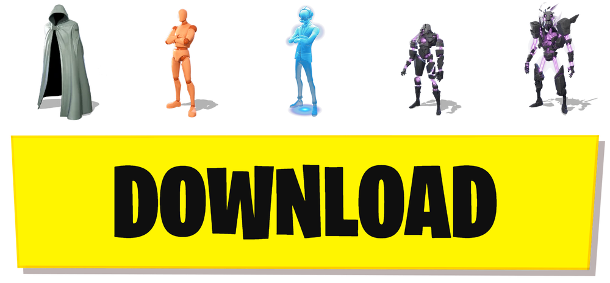

# Wraith

<div align="center">

<a href="#">
  
</a>


</div>

---

This guide and dev was created by @xyro.py for the Xoid's City Community
Please join Xoid's City for more awesome stuff like this!
https://dsc.gg/xoids-city

---

## How To Run

START BY RUNNING "INSTALL PYTHON"

ONCE THAT'S DONE, RUN "INSTALL ALL"

THEN, WHEN IT'S FINISHED, START "Wraith"

THE REST IS PRETTY STRAIGHT FORWARD.

LAUNCH FORTNITE.

CLOSE Wraith TO STOP IT FROM THE TOP RIGHT CORNER (IF YOU DON'T CLOSE IT FROM TOP RIGHT CORNER YOU WILL EXPERIENCE CONNECTION ISSUES!!)
If you mistakenly closed it from the taskbar, you will need to restart it and try again.
---

## Skins That Work Well

- Skull Trooper
- FishStick
- Lara Croft
- Party Trooper
- Master Chief
- Ghoul Trooper
- Kratos
- The Paradigm
- Omega
- Aerial Assault Trooper
- Renegade Raider

---

## WARNING

YOU CAN'T WEAR ANY COSMETIC YOU WANT.

You technically still have to own the cosmetic.

It only unlocks the styles of a cosmetic you already own.

EXAMPLE: If you own Skull Trooper, you can use the Purple Style even if you don't own that style.

HOWEVER, if you don't own Skull Trooper at all, you will be kicked from the match.

---

## No Kick Method

How to equip cosmetics in UEFN / Creative 2.0 that you don't own

1. Join any UEFN / Creative 2.0 game with a friend.
2. Leave the game and friend's party after 3 seconds.
3. Wait in the lobby for 10 seconds.
4. Rejoin the same game/session using a friend or an alt account. (WITH THE JOIN GAME BUTTON)
5. Once you're back in the game, wait 2.5 minutes.
6. After the 2.5 minutes, enter a booth and equip the cosmetics you want.
7. Have fun!

NOTE: If you can't rejoin the map, it may already be full with players. Try again on a different mode. (MAKE SURE FRIEND IS NOT APPEARING AWAY!)

### Important and Helpful Information

- **Sometimes "Matchmaking Error #1 Unknown Error" when you are trying to join match again happens. IT means you have less chance of staying after "Error". You should make your friend or alternate account leave the match so you can do a different map**

---

## Installation

### Quick Start (Windows)

Simply run these 3 files:

1. `INSTALL ALL.bat`
3. `Wraith.bat`


> ⚠️ **SSL Certificate Note:** If you see yellow messages in the log saying "SSL handshake failed" or similar SSL errors, run `INSTALL ALL.bat` as administrator one time to fix this permanently.

---

## SIMPLE Usage

```batch
Start Wraith.exe
```

---

## Safety Notes

- It does not modify any game files, inject code into the game, or affect your actual game files or account
- Use at your own risk as it may lead to account and HWID bans (NONE YET)
- Not affiliated with Epic Games

---

## License

This project is provided as-is for educational purposes.

---


<div align="center">

**Made for the Xoid's City community**

</div>
